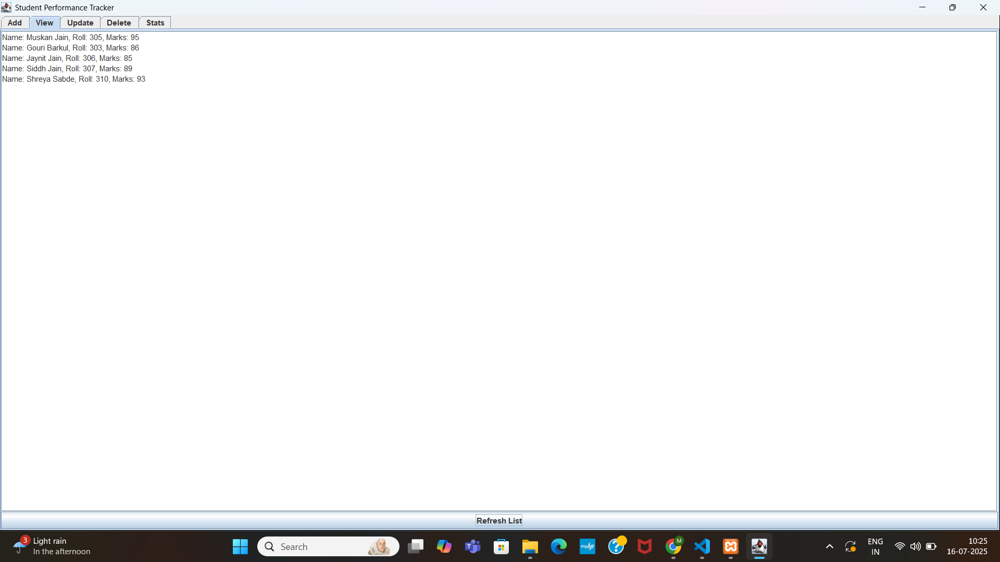

# 🎓 Student Performance Tracker

A simple Java Swing application to manage student records, including features to add, view, update, delete, and analyze student marks.

---

## 🚀 Features

- ➕ Add a student
- 👁️ View all students
- 🔄 Update student details
- ❌ Delete a student by roll number
- 🏆 Show topper
- 📊 Show average marks

---

## 🖥️ Screenshots



---

## 🛠️ Technologies Used

- Java
- Swing (GUI)
- File Handling (for saving student data)
- Basic OOP (Object-Oriented Programming)

---

## 📂 How to Run

1. Clone the repo:
   ```bash
   git clone https://github.com/yourusername/StudentPerformanceTracker.git
